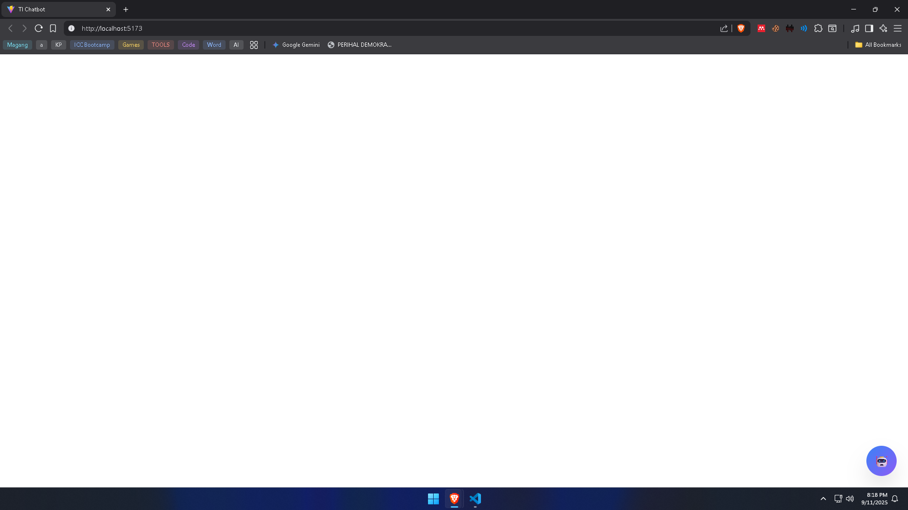
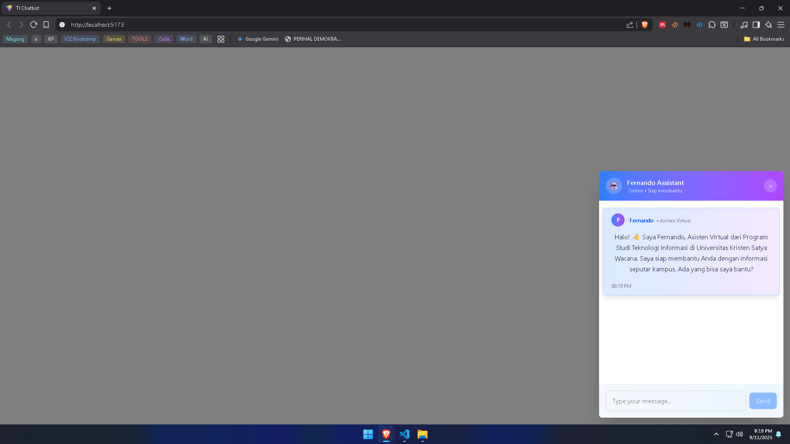

# ChatBot-Website 🚀

[](https://www.typescriptlang.org/)
[](https://react.dev/)
[](https://www.php.net/)

[](http://forthebadge.com)

Chatbot Powered by Gemini AI, Custom Chatbots for Specific Websites.
# 📌 Feature
* Custom Chat
* Multi-Platform
* Smart Search
## Benefit
### Development
* 🎯 __Modular component__ structure
* 🎯 __Reusable components__ untuk future features
* 🎯 __Maintainable code__ dengan clear separation
* 🎯 __Scalable architecture__ untuk enhancements
# Tech Stack
* *Backend  : Laravel 12, PHP 8.3.16*
* *Frontend : React + Vite + Typescript*
* *Database : MySQL*
* *AI        : Gemini AI*
# 📂 Project Structure
>├── backend/        # Laravel project </br>
├── frontend/       # React project </br>
└── README.md       # Dokumentasi</br>
# 💡 Installation
```
# Clone repo
git clone https://github.com/chxxlk/Chatbot-Website.git

# Masuk Foleder backend
cd gemini-chatbot-backend
composer install
cp .env.example .env
# Tambahkan Databse, Gemini API, Cors, dll di .env

# Masuk folder frontend
cd gemini-chatbot
npm install
```
### ⚠️ Untuk depedencies bisa dilihat di package.json
* Frontend : [package.json](./gemini-chatbot/package-lock.json)
* Backend : [package.json](./gemini-chatbot-backend/package.json)

# ▶️ Usage
```
# Jalankan backend
php artisan serve

# Jalankan frontend
npm run dev
```
# 📷 Screenshot
<p align="center">  </p>
<p align="center">  </p>

# 🌟 Support
Kalau Repo ini bermanfaat, jangan lupa kasih ⭐ di GitHub ya!
