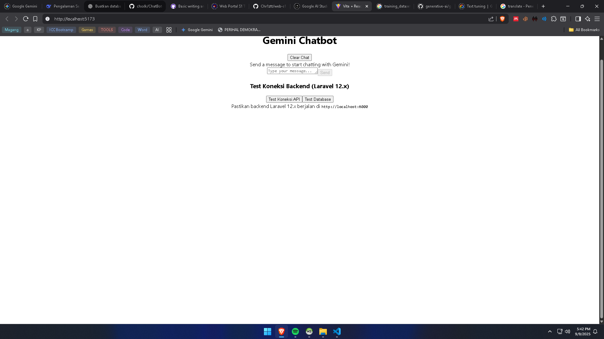
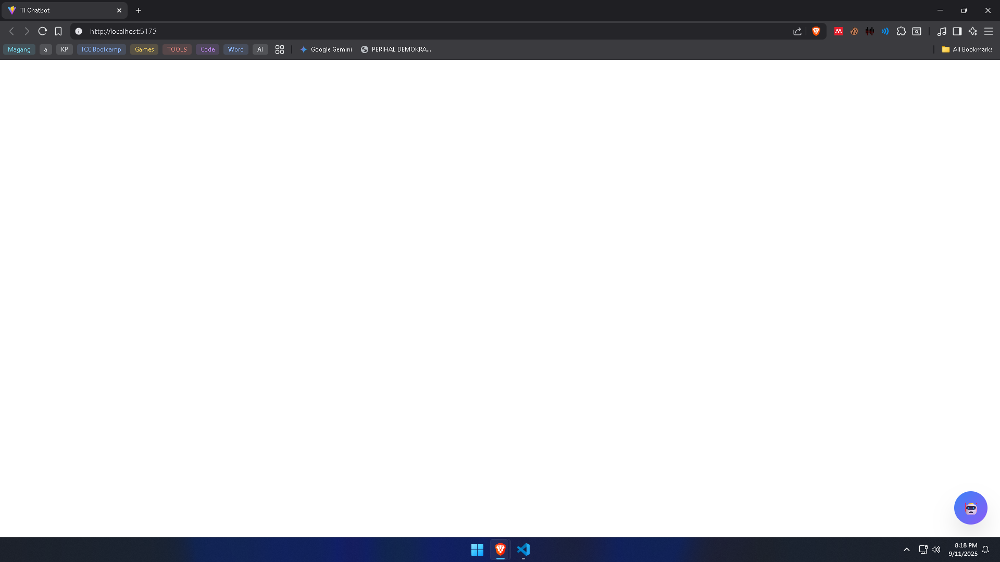
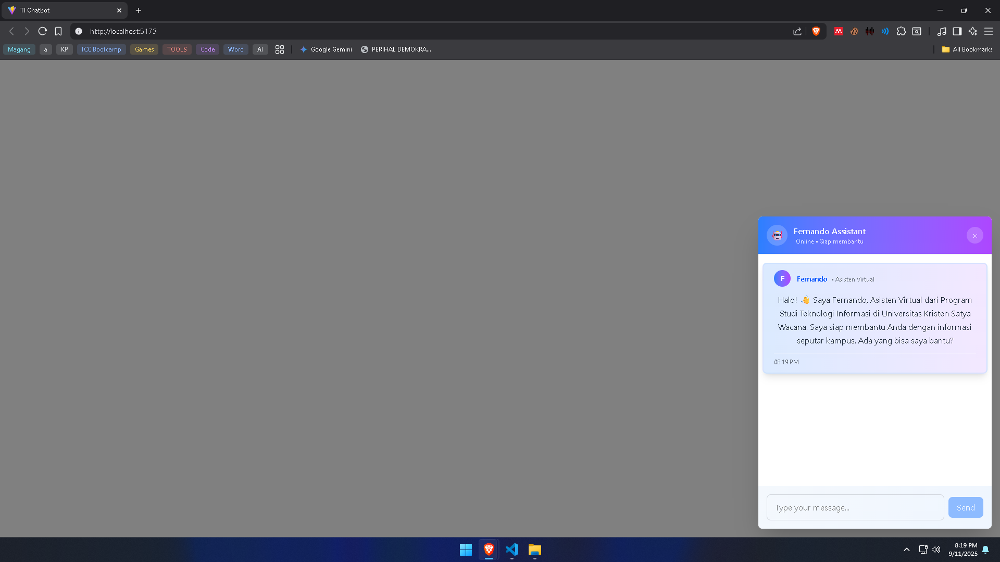

<div align="center">

# ChatBot-Website 🤖

**AI-Powered Chatbot for the FTI UKSW Website**  
Custom, intelligent assistant with RAG-based semantic search — built for the Faculty of Information Technology at Satya Wacana Christian University.

[](LICENSE)
[](https://laravel.com)
[](https://react.dev)
[](https://www.typescriptlang.org/)
[](https://github.com/pgvector/pgvector)
[](https://www.docker.com/)
[](#)

</div>

---

## 📋 Table of Contents

- [Overview](#-overview)
- [Features](#-features)
- [Tech Stack](#-tech-stack)
- [Architecture](#-architecture)
- [Getting Started](#-getting-started)
  - [Local Development](#local-development)
  - [Docker Deployment](#docker-deployment)
- [Environment Variables](#-environment-variables)
- [API Reference](#-api-reference)
- [Screenshots](#-screenshots)
- [Contributing](#-contributing)
- [License](#-license)

---

## 📖 Overview

ChatBot-Website provides an intelligent conversational interface for the **FTI UKSW** (Faculty of Information Technology, Satya Wacana Christian University) website. Visitors can ask questions about the faculty — programs, staff, news, and more — and get accurate answers powered by a **Retrieval-Augmented Generation (RAG)** pipeline.

The system combines:
- **Large Language Models** via [OpenRouter](https://openrouter.ai/) (Deepseek, Gemma, and others)
- **Vector embeddings** using [HuggingFace Inference API](https://huggingface.co/docs/api-inference/index) or local [Ollama](https://ollama.ai/) models
- **Semantic search** with [pgvector](https://github.com/pgvector/pgvector) on PostgreSQL

> Built for the FTI UKSW academic website — easily adaptable to any domain.

---

## ✨ Features

| Feature | Description |
|---------|-------------|
| **💬 Custom Chat** | AI-powered conversational interface with streaming responses (SSE) |
| **🔍 Smart Search (RAG)** | Semantic search over faculty content using vector embeddings |
| **⚡ Real-Time Streaming** | Server-Sent Events for instant, streaming chat responses |
| **🧠 Configurable AI** | Switch between OpenRouter models or run local models via Ollama |
| **📱 Multi-Platform** | Responsive floating chat button + modal works on desktop and mobile |
| **📜 Chat History** | Session-based conversation history |

---

## 🛠 Tech Stack

### Backend

| Technology | Version | Purpose |
|------------|---------|---------|
| [Laravel](https://laravel.com/) | 12 | PHP framework — API routing, controllers, ORM |
| [PHP](https://www.php.net/) | ^8.2 | Runtime |
| [FrankenPHP](https://frankenphp.dev/) | — | Production-grade PHP app server (Docker) |
| [OpenRouter API](https://openrouter.ai/) | — | LLM inference (Deepseek v3, Gemma, etc.) |
| [HuggingFace Inference API](https://huggingface.co/docs/api-inference) | — | Text embeddings for RAG |
| [pgvector](https://github.com/pgvector/pgvector) | ^0.2.2 | Vector similarity search on PostgreSQL |
| [Ollama](https://ollama.ai/) | — | *Optional* local LLM & embeddings |
| [PostgreSQL](https://www.postgresql.org/) | 17 | Primary database |

### Frontend

| Technology | Version | Purpose |
|------------|---------|---------|
| [React](https://react.dev/) | 19 | UI framework |
| [TypeScript](https://www.typescriptlang.org/) | ~5.8 | Type-safe JavaScript |
| [Vite](https://vitejs.dev/) | ^7.1 | Build tool & dev server |
| [Tailwind CSS](https://tailwindcss.com/) | ^4.1 | Utility-first styling |
| [Axios](https://axios-http.com/) | ^1.11 | HTTP client |
| [React Markdown](https://github.com/remarkjs/react-markdown) | ^10.1 | Render AI responses as Markdown |

### Infrastructure

| Tool | Purpose |
|------|---------|
| [Docker](https://www.docker.com/) + [Compose](https://docs.docker.com/compose/) | Container orchestration |
| [GitHub Actions](https://docs.github.com/en/actions) | CI/CD |

---

## 🏗 Architecture

```
├── backend/                  # Laravel 12 API
│   ├── app/
│   │   └── Http/
│   │       └── Controllers/
│   │           ├── ChatbotController.php    # Chat, streaming, history
│   │           └── ChatbotInfoController.php # Bot info & welcome
│   ├── config/               # Laravel config files
│   ├── database/             # Migrations & seeders
│   ├── routes/
│   │   └── api.php           # API route definitions
│   ├── Dockerfile            # FrankenPHP container
│   └── .env.example          # Environment template
│
├── frontend/                 # React + Vite + TypeScript
│   ├── src/
│   │   ├── components/       # Chat UI components
│   │   ├── hooks/            # useOpenRouter hook
│   │   ├── types/            # TypeScript type definitions
│   │   └── utils/            # Utility functions
│   ├── Dockerfile            # Nginx Node container
│   └── .env.example          # Frontend env template
│
├── postgres/                 # Database init & config
│   ├── init.sql              # Schema initialization
│   └── compose.yaml          # Standalone DB compose
│
├── compose.yaml              # Main Docker Compose (all services)
├── img/                      # Screenshots
├── CONTRIBUTING.md           # Contribution guide
└── README.md                 # You are here
```

### How It Works

```
User → Frontend (React) → HTTP/SSE → Backend (Laravel)
                                                                                          |
                                                                ┌─────┴──────┐
                                                                │  OpenRouter                          |
                                                                │  (LLM)                                      |
                                                                └─────┬──────┘
                                                                                          |
                                                                ┌─────┴──────┐
                                                                │  pgvector                                |
                                                                │  (RAG)                                      |
                                                                └────────────┘
```

1. User sends a message via the floating chat button
2. Backend embeds the query (HuggingFace / Ollama) and performs vector similarity search on pgvector
3. Retrieved context + query are sent to the LLM (via OpenRouter)
4. Response streams back to the frontend via Server-Sent Events (SSE)

---

## 🚀 Getting Started

### Prerequisites

- [PHP ^8.2](https://www.php.net/downloads) + [Composer](https://getcomposer.org/)
- [Node.js ^22](https://nodejs.org/) + [npm](https://www.npmjs.com/)
- [PostgreSQL 17+](https://www.postgresql.org/download/) with [pgvector](https://github.com/pgvector/pgvector#installation)
- [Docker](https://docs.docker.com/get-docker/) (optional — for containerized setup)

### Local Development

#### 1. Clone & Install Dependencies

```bash
git clone https://github.com/chxxlk/ChatBot-Website.git
cd ChatBot-Website
```

**Backend:**
```bash
cd backend
cp .env.example .env
composer install
```

**Frontend:**
```bash
cd frontend
cp .env.example .env
npm install
```

#### 2. Configure Environment

Edit `backend/.env` — at minimum set:

```env
DB_CONNECTION=pgsql
DB_HOST=127.0.0.1
DB_PORT=5432
DB_DATABASE=website_ti
DB_USERNAME=postgres
DB_PASSWORD=your_password

OPENROUTER_API_KEY=sk-or-...
OPENROUTER_MODEL=google/gemma-3-27b-it:free
OPENROUTER_BASE_URL=https://openrouter.ai/api/v1

HF_API_KEY=hf_...
HF_MODEL=Qwen/Qwen3-Embedding-8B
HF_BASE_URL=https://router.huggingface.co

APP_URL=http://localhost:8000
```

Edit `frontend/.env`:
```env
VITE_API_BASE_URL=http://localhost:8000
```

#### 3. Database Setup

```bash
cd backend
php artisan migrate:fresh --seed
```

> Requires a running PostgreSQL instance with pgvector extension.

#### 4. Run the Development Servers

```bash
# Terminal 1 — Backend
cd backend
php artisan serve --host=0.0.0.0 --port=8000

# Terminal 2 — Queue worker (for history, etc.)
cd backend
php artisan queue:listen --tries=1

# Terminal 3 — Frontend
cd frontend
npm run dev
```

Or use Laravel's built-in dev command from the `backend` directory:

```bash
composer run dev
```

Open [http://localhost:5173](http://localhost:5173) in your browser.

### Docker Deployment

The easiest way to run the full stack:

```bash
docker compose up -d
```

This starts three services:
- **website-db** — PostgreSQL 17 with pgvector
- **backend** — Laravel API on FrankenPHP (port `8000`)
- **frontend** — React + Vite dev server (port `3000`)

> Set API keys (`OPENROUTER_API_KEY`, `HF_API_KEY`) in `compose.yaml` before running.

---

## 🔐 Environment Variables

### Backend (`backend/.env`)

| Variable | Required | Default | Description |
|----------|----------|---------|-------------|
| `APP_KEY` | ✅ | — | Laravel app key (`php artisan key:generate`) |
| `APP_URL` | ✅ | `http://localhost:8000` | Base URL for the backend |
| `DB_CONNECTION` | ✅ | `pgsql` | Database driver |
| `DB_HOST` | ✅ | `127.0.0.1` | Database host |
| `DB_PORT` | ✅ | `5432` | Database port |
| `DB_DATABASE` | ✅ | — | Database name |
| `DB_USERNAME` | ✅ | — | Database user |
| `DB_PASSWORD` | ✅ | — | Database password |
| `OPENROUTER_API_KEY` | ✅ * | — | OpenRouter API key for LLM |
| `OPENROUTER_MODEL` | ✅ * | — | Model name (e.g. `google/gemma-3-27b-it:free`) |
| `OPENROUTER_BASE_URL` | ✅ * | — | OpenRouter endpoint |
| `HF_API_KEY` | ✅ * | — | HuggingFace API key for embeddings |
| `HF_MODEL` | ✅ * | — | Embedding model name |
| `HF_BASE_URL` | ✅ * | — | HuggingFace endpoint |
| `OLLAMA_BASE_URL` | ❌ | `http://localhost:12434` | *Optional* — local Ollama |
| `OLLAMA_EMBEDDING_MODEL` | ❌ | — | *Optional* — local embedding model |

> \* Required when using OpenRouter/HuggingFace. If using local Ollama, these are optional.

### Frontend (`frontend/.env`)

| Variable | Required | Description |
|----------|----------|-------------|
| `VITE_API_BASE_URL` | ✅ | Backend API URL (e.g. `http://localhost:8000`) |

---

## 📡 API Reference

All API routes are prefixed under the backend base URL.

### Chat

| Method | Endpoint | Description |
|--------|----------|-------------|
| `POST` | `/api/chat` | Send a message and receive a response |
| `GET` | `/api/chat/stream` | Streaming chat via Server-Sent Events |
| `GET` | `/api/history` | Retrieve conversation history |

### Info

| Method | Endpoint | Description |
|--------|----------|-------------|
| `GET` | `/api/chatbot/info` | Bot metadata and capabilities |
| `GET` | `/api/chatbot/welcome` | Welcome message configuration |

### Diagnostics

| Method | Endpoint | Description |
|--------|----------|-------------|
| `GET` | `/api/test` | General connection test |
| `GET` | `/api/test/openrouter` | Test OpenRouter API connectivity |
| `GET` | `/api/test/hf` | Test HuggingFace embedding API |
| `GET` | `/api/test/db` | Test database connection |

---

## 📷 Screenshots

<div align="center">
  
  <br/>
  <em>Chat interface — floating button and modal</em>
  <br/><br/>
  
  <br/>
  <em>Conversation with AI assistant</em>
  <br/><br/>
  
  <br/>
  <em>Streaming response in action</em>
  <br/><br/>
  
  <br/>
  <em>Full-page chat interface</em>
</div>

---

## 🤝 Contributing

Contributions are welcome! Please see [CONTRIBUTING.md](CONTRIBUTING.md) for guidelines.

Have a feature request or found a bug? Open an issue using one of our templates:
- [🐛 Bug Report](.github/ISSUE_TEMPLATE/bug_report.md)
- [✨ Feature Request](.github/ISSUE_TEMPLATE/feature_request.md)

---

## 📄 License

This project is open source under the [MIT License](LICENSE).  
Copyright © 2025 [Chris Stevanus Lekpey](https://github.com/chxxlk)

---

<div align="center">
  <strong>Built with ❤️ for FTI UKSW</strong>
  <br/>
  <sub>If you find this project useful, please ⭐ the repo!</sub>
</div>
