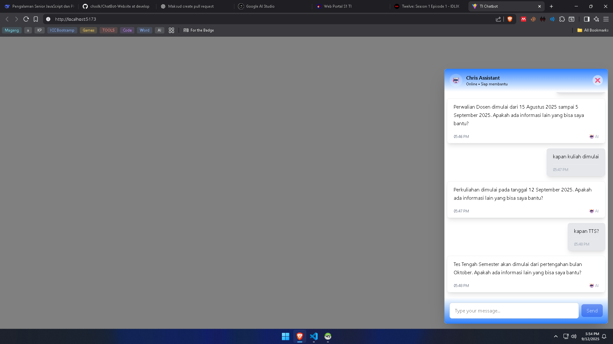

# ChatBot-Website 🚀
Chatbot Powered by Gemini AI, Custom Chatbots for Specific Websites.
# 📌 Feature
* Custom Chat
* Multi-Platform
* Smart Search
# Tech Stack
* *Backend  : Laravel 12, PHP 8.3.16*
* *Frontend : React + Vite + Typescript*
* *Database : PostgreSQL + pgvector*
* *AI        : Model Deepseek 3.1 with OpenRouter*
# 📂 Project Structure
>├── backend/        # Laravel project </br>
>├── frontend/       # React project </br>
>└── README.md       # Dokumentasi</br>
# 💡 Installation
```
# Clone repo
git clone https://github.com/chxxlk/Chatbot-Website.git

# Masuk Foleder backend
cd backend
composer install
cp .env.example .env
# Tambahkan Databse, Openrouter API, Hugginface API untuk embedding, Cors, dll di .env
# Jalankan Migrate dan Seeder
php artisan migrate:fresh --seed

# Masuk folder frontend
cd frontend
cp .env.example .env
npm install
```
# ▶️ Usage
```
# Jalankan backend
php atisan serve --host=0.0.0.0 --route=8000 //untuk running local

# Jalankan frontend
npm run dev
```
# 📷 Screenshot
<p align="center">  </p>

# 🌟 Support
Kalau Repo ini bermanfaat, jangan lupa kasih ⭐ di GitHub ya!